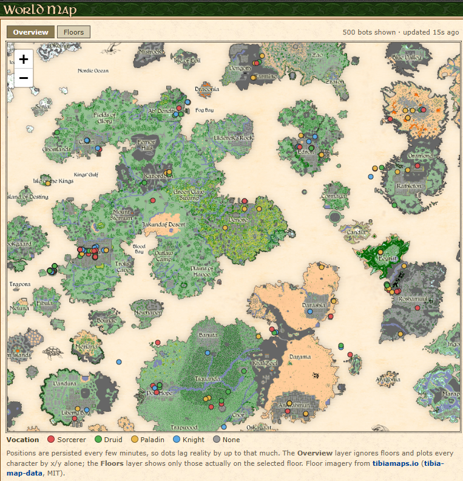
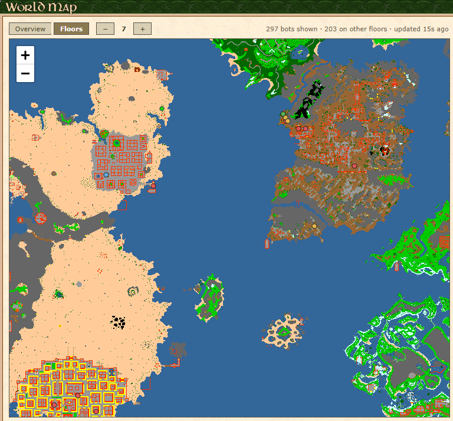
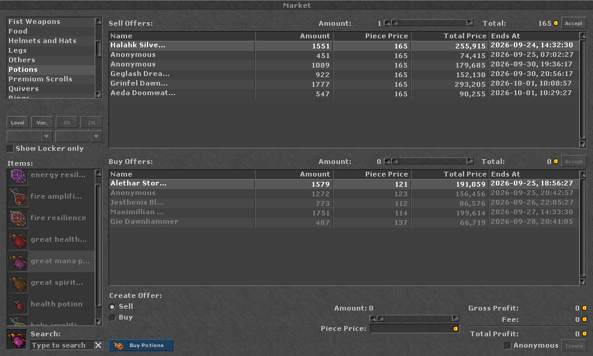
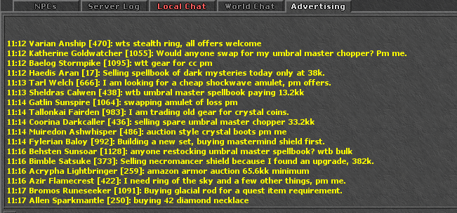
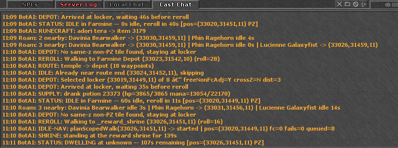

# Canary Bots with Cast

A ready-to-run fork of the [OpenTibiaBR / Canary](https://github.com/opentibiabr/canary)
MMORPG server that adds **autonomous bot players** and a **cast (spectator)
system** — so a fresh server feels populated, and anyone can watch a live
character (including bots) without an account.

- **Bot players** hunt, travel between cities, chat, trade on the market, own
  houses, form parties, and defend themselves. You choose how many are online
  (0 → ~997).
- **Cast** lets spectators log in with the account name `@cast` and watch any
  broadcasting character; bots broadcast automatically and wake on click.

## What's in it

**World & liveness**
- Bots idle, wander, dwell at points of interest, and travel between 14 cities on their own.
- **Ambient roam** — bots materialise on a vetted tile just off your screen, wander nearby across floors, then hibernate back when you leave, so the world feels lived-in wherever *you* are.
- Bots nobody can see **hibernate**; they wake within 100-200 ms when a player or cast viewer arrives.
- **Proximity weighting** biases what hibernated bots do next toward where real players are.
- **Density caps** keep a crowd from piling onto one player, in three concentric rings.
- Human motion: mid-walk pauses, turn-in-place fidgets, mounts, per-bot outfits and personalities.
- Bots occasionally **drop a cheap item** where they stop, leaving litter that makes areas look used.

**Navigation**
- True **multi-floor routing** over a portal graph — stairs, ladders, ropes, holes and teleporters.
- **Door-aware planner**: doors are waypoints, and a bot walks to a far blocking door and opens it.
- **City-route detour splicing** removes pointless z-excursions from authored routes.
- Per-bot **path jitter**, **walking lanes**, **junction branching** and **route-phase desync** — two bots on the same street pick different tiles instead of forming a conga line.
- **NPC approach anchors** so a bot walks up to an NPC and greets it, instead of standing on top of it.
- Tick deadlines and caches keep pathfinding off the critical path; an offline simulator gates changes.

**Hunting**
- 258 enabled hunt scripts, including 20 multi-leg quest routes, with one bot per spawn.
- **Lure mode** — hold fire, walk the patrol while a pack trails you, then engage it all at once.
- **Kite-backtrack** — a cornered keep-distance bot retraces walked waypoints instead of tanking.
- Bots **loot the corpses** they killed, and buy potions, food and runes.
- Supply behaviour: potions, food, **rune crafting**, and **fishing** (they fight back at the shore).

**Parties**
- Bots accept your party invite from the client, and **walk in to assemble** rather than teleporting.
- Followers trail the leader's actual path, replaying floor transitions exactly.
- Bot-led party hunts with elected leadership, a bounded wait for stragglers, and a population cap.

**Combat & PvP**
- Vocation-appropriate spell ladders, healing, support spells and runes.
- Self-defense, retaliation, and a party that joins its leader's fight.
- Occasional **gang raids** and random PK, all observer-gated and rate-limited.

**Market — an Auction-House bot, like AHbot on WoW emulators**
- Ships with a **pre-populated market**, so the board is never empty on a fresh server.
- Bots **continuously create new buy and sell orders**, cancel stale ones, and re-stock the book.
- **Real player orders are prioritised**: every offer owned by a human gets its own independent roll each sweep, then a price gate — bots deliberately overpay on the sell side and under-bid on the buy side so a fairly-priced listing actually clears.
- Depth caps steer new offers to empty books; no-reference items are guarded against gold-faucet abuse.
- Every knob is in `config.lua`, and each sweep logs one `[MARKET_ACCEPT]` line with a per-reason breakdown, so "why was my offer not accepted" is answerable from the journal.

**Chat**
- ~4,400-template corpus: observer-gated local banter, keyword replies, and PMs (even to hibernated bots).
- Trade adverts on the **Advertising** channel, deduplicated across the whole population.

**Houses & shrines**
- Bots own and furnish ~794 houses; they idle, use hirelings, train on dummies and use lockers.
- Players can claim or sub-own a bot house; releasing it hands it back with the furniture restored.
- Bots idle at **reward and imbuing shrines**, including shrines standing inside houses.

**Engine & operations**
- The bot engine is a **modular C++ shared library** — ~53k lines across **21 translation units** (tick, combat, party, hunt, nav, zgraph, waypoint, travel, poi, roam, supply, house, shrine, chat, liveness, debug, command, data, csv, lifecycle) compiled into one `libbot_engine.so`.
- **Hot-reload**: `/cavebot reload` swaps the engine and re-reads all authored data with no server restart.
- Authored bot data is **CSV in git** (`data/bot/authored/`) — no database round-trip to add a hunt.
- Deep `/cavebot` command surface, debug mode with a live ASCII heartbeat grid, and a perf-gate harness.
- A **live World Map** web page showing where every online character is (see below).

---

Behavior, commands, and tuning: **[data/scripts/lib/BOT_SYSTEM_DOCS.md](data/scripts/lib/BOT_SYSTEM_DOCS.md)**.
Complete developer documentation (architecture, behavior internals, performance,
and tuning) for continuing development: **[data/scripts/lib/BOT_SYSTEM_DOCS_EXTENDED.md](data/scripts/lib/BOT_SYSTEM_DOCS_EXTENDED.md)**.

## 🎥 Demo

Clips of the bot system in action — 720p/60fps (the two ~5-minute "tour" clips are 480p/60fps). Click any clip to play.

Only the "GOD" and "Legolas" characters are being controlled manually to demonstrate the bot features. The rest of the players are ALL bots.

### Bots living in the world

**Bots walking around the city**

https://github.com/user-attachments/assets/dbed64ea-f161-43d2-9145-d106bedecf01

**Adventurer-stone bots**

https://github.com/user-attachments/assets/762f2661-866e-43f5-8c08-980f7c166a36

**Houses owned &amp; decorated by bots**

https://github.com/user-attachments/assets/282b8c4e-047e-4dd3-bb2d-3972e45b9d56

### Hunting &amp; questing

**Bot team hunt** _(~5 min, in 3 parts)_

Part 1

https://github.com/user-attachments/assets/71c8b5b1-83c7-4b7c-b3db-4c9e2c5f3385

Part 2

https://github.com/user-attachments/assets/aad08b1e-14e1-4835-b701-d13a2c23b992

Part 3

https://github.com/user-attachments/assets/318778e7-ac0a-4ef7-a292-df20398615e5

**Bots questing**

https://github.com/user-attachments/assets/677683d3-a918-4173-9fa2-84a8b06a31fa

**Full tour — depot, cities &amp; more** _(~5 min)_

https://github.com/user-attachments/assets/5c86888e-603b-4c44-9041-f940f94e14ad

### PvP / PK

**PK bot team jumping a player**

https://github.com/user-attachments/assets/6ed612d8-e7cc-43e0-8032-c52b8664483e

**PK bot chasing a player**

https://github.com/user-attachments/assets/21e2b835-3b74-4758-9b87-460d076bb60b

### Systems

**Cast character list**

https://github.com/user-attachments/assets/f8275ba5-20b4-4e05-82fe-6592361d3c8f

**Market bot offers**

https://github.com/user-attachments/assets/022c82b5-0315-4f14-a618-3c7d3e77eca1

## 📸 Screenshots

### Live World Map

A MyAAC Community page plotting every online character from the position columns
the server already persists — no extra telemetry, no load on the game server.

**Overview** — floor-agnostic, every character by x/y over the world artwork:



**Floors** — per-floor minimap renders with a `− 7 +` stepper, showing only the
characters actually on that floor:



### Market

Bots keep the auction house stocked and clear real players' orders:



### Advertising channel

Bots post deduplicated trade adverts, so the trade channel is never dead:



### Cast chat — live bot activity log

While spectating, the Cast Chat channel streams what the bot is actually doing,
which doubles as the debugging surface:



> [!NOTE]
> **Base version.** This repository is forked from `opentibiabr/canary` at commit
> **`ded10949d`** (2026-02-19) and adds the bot + cast features on top. Use that
> commit as the reference point for the underlying Canary version/protocol.

## Tested on

| | |
|---|---|
| Host | Proxmox LXC container |
| OS | Ubuntu 22.04.5 LTS (kernel 6.8.x) |
| CPU | Intel Core i5-6260U (4 vCPU) |
| RAM | 8 GB |
| DB | MySQL / MariaDB |
| Web | nginx + php-fpm 8.1 + MyAAC |
| Client | OTClient Redemption (protocol 13+) |

It runs comfortably with a few hundred bots online on this modest spec.

---

## Quick start

> The build toolchain (vcpkg + CMake) is identical to upstream Canary. If you are
> new to building Canary, follow the official
> [build guides](https://github.com/opentibiabr/canary/tree/main/docs/building)
> for the vcpkg/`VCPKG_ROOT` setup first — then build **this** repo (it already
> contains the bot engine source).

### 1. Build

```bash
git clone <this-repo-url> canary-bots
cd canary-bots
cmake --preset linux-release -DTOGGLE_BIN_FOLDER=ON
cmake --build --preset linux-release -j4
# Low-RAM machines: build with fewer jobs, e.g.
#   cmake --build build/linux-release -j2
```

Outputs `canary` and `libbot_engine.so` under `build/linux-release/bin/`. Copy
both next to your server working directory.

> Prefer not to compile? Prebuilt Linux binaries (`canary` + `libbot_engine.so`)
> are attached to the GitHub **Releases** for this repo.

### 2. Database

```bash
mysql -u root -p -e "CREATE DATABASE canary DEFAULT CHARSET=utf8mb3;"
mysql -u root -p canary < schema.sql
# Seed the bot data (god account, bot account, bots, hunts, market, …):
cd database/bots && DB_USER=root DB_PASS=yourpass DB_NAME=canary ./import.sh
```

See [database/bots/README.md](database/bots/README.md) for the manual import
order and details. Default admin login afterwards is account **`@god`** /
password **`god12345`** — change it after first login.

### 3. Configure

```bash
cp config.lua.dist config.lua
```

Edit `config.lua`: set your `mysql*` connection, `ip = "127.0.0.1"` for a local
install, and the bot keys (see below). Then download the world map
[`otservbr.otbm`](https://github.com/opentibiabr/canary/releases) from the
upstream Canary release matching the base version and place it per `mapName`.

### 4. Run

Start `canary` (the `.so` is loaded automatically). On first boot the migrations
finish setting up the bot tables. Connect with an OTClient (protocol 13+).

### 5. (Optional) Website + cast + client

- **Website / cast login:** install [MyAAC](https://github.com/slawkens/myaac)
  and drop in our cast-aware `deployment/web/login.php` (it intercepts the
  `@cast` account). See [deployment/client/README.md](deployment/client/README.md)
  for the OTClient `init.lua` (`Services` / `Servers_init`) settings.
- **World Map page:** `deployment/web/plugins/worldmap/` — a MyAAC plugin that
  adds a live map under *Community* showing where every online bot is, with a
  floor-agnostic overview layer and a per-floor layer. It reads the position
  columns the server already persists, so it costs the game server nothing.
  Install notes: [plugins/worldmap/README.md](deployment/web/plugins/worldmap/README.md).
- **Client:** [OTClient Redemption](https://github.com/opentibiabr/otclient).

---

## Bots at a glance

- **How many:** `botPlayersOnline` in `config.lua` (default `500`, range `0`–~997).
- **What they do:** idle/wander, walk to POIs (depot/temple/shops/NPCs), hunt,
  travel by boat, chat (observer-gated banter + trade ads + keyword replies),
  trade on the market, own & furnish houses, form parties, defend themselves,
  and occasionally run gang raids. Bots no one can see **hibernate** to keep CPU
  flat and **wake** when a player or cast viewer comes near.
- **Geared & alive:** level/vocation-appropriate equipment with forge tiers and
  imbuements, mounts, human-like mid-walk pauses, and the occasional dropped item.

### Key commands

**Player-facing** — anyone can use these:

| Command | Purpose |
|---|---|
| `/cavebot claim [name]` | **Reserve the hunt spawn you're standing in** — the bot working it leaves and no bot takes it for ~1h. It also flags you as hunting, so while you're outside a town, wandering bots stay away and the hunt selector stops steering bots toward you. |
| `/cavebot release` | Release the spawn **and** clear the hunting flag |
| `/party <vocs> [min,max] [teleport]` | Summon bots into your party — e.g. `/party ek,ed 100,500`. They **walk in** to assemble; `teleport` forces instant assembly instead |
| `/party leave` | Dismiss your party bots (each rolls its next activity from where it stands) |
| *(client invite)* | Inviting a bot from the game client works too — it accepts after 1.5-4.5s unless it's mid-fight or on a bot party hunt |
| `/cast on` · `/cast off` | Start / stop broadcasting your character |
| `/house "<name>" owner` | Claim a free bot house (needs no house + enough gold for rent) |
| `/house "<name>" sub-owner` | Become sub-owner of a bot house |
| `/house "<name>" release` | Release a house you claimed — the bot reclaims it, furniture restored verbatim |

**Admin (`god`)** — the most-used of a much larger surface:

| Command | Purpose |
|---|---|
| `/cavebot active` · `population` | List active bots / per-town counts by state |
| `/cavebot reload` | Hot-reload the engine **and** all authored data — no restart |
| `/cavebot _global reloadconfig` | Re-read `config.lua` values without a restart |
| `/cavebot reload debug,<Bot Name>` | Isolate ONE named bot with full telemetry + ASCII heartbeat grid |
| `/cavebot activity` | Nominal vs eligible vs **realised** activity shares, awake vs hibernated |
| `/cavebot botcfg` | Dump every bot tunable **as actually loaded** from `config.lua` |
| `/cavebot whohunts [search]` | Which bot holds which hunt-spawn reservation |
| `/cavebot claims` · `clearclaim <name>` | List player spawn-claims / force-release one |
| `/cavebot partyinfo` · `partystop <name>` | Inspect / dissolve bot party hunts |
| `/cavebot roam` | Ambient-roam sessions, per-cluster counts, suppressed anchors |
| `/cavebot route x,y,z x,y,z` | Full tile-by-tile route between two points (`zplan` = z-hops only) |
| `/cavebot shrines` · `fishspots` · `houseinfo` | What each runtime scan actually found |

Spectate: log in with account name **`@cast`** (no password) and pick a character.

Full command list: [BOT_SYSTEM_DOCS.md §12](data/scripts/lib/BOT_SYSTEM_DOCS.md).

### Configuration (`config.lua`)

All **240** `bot*` keys live in `config.lua` — there is deliberately no second
config file and no override layer. Changing a **value** is hot
(`/cavebot _global reloadconfig`); adding or renaming a key needs a rebuild.

```lua
botPlayersOnline       = 500    -- how many bots load at startup (0 disables)
botPlayersShowAsOnline = true   -- count bots in the online list
botDensityCapEnabled   = true   -- cap how many bots wake around a player
botRoamEnable          = true   -- ambient roam: bots wander near players
botTelemetryEnabled    = false  -- leave off in production
```

#### What a bot decides to do — the percentage tables

The odds governing **what a bot does next** are three tables. **A and B must each
sum to 100**; if one doesn't, the server boots anyway, uses the numbers as
written, and stamps `TABLE A/B INVALID` on `/cavebot botcfg` until you fix it.

**TABLE A — which activity to start** (sampled every `botActivityRerollCooldownSec`, 30s):

```lua
botActivityDwell  = 12   -- stand around / micro-idle
botActivityPoi    = 30   -- walk to a point of interest  -> TABLE B
botActivityHunt   = 10   -- take a hunt script
botActivityParty  = 2    -- form or join a party hunt
botActivityTravel = 46   -- travel to another city
```

**TABLE B — which POI**, rolled over what the bot's current town actually has:

```lua
botPoiDepot = 19   botPoiDepotOutside = 9   botPoiTemple = 5
botPoiBoat  = 8    botPoiShop         = 5   botPoiNpc    = 13
botPoiWater = 14   botPoiHouse        = 13  botPoiAdvStone = 6
botPoiRewardShrine = 4   botPoiImbuingShrine = 4
```

**TABLE C — what to do inside a house** (`botPoiHouse` only opens the door):

```lua
botHouseIdle = 26   botHouseHireling = 20   botHouseDummy = 20
botHouseLocker = 19 botHouseShrine   = 15
```

`botActivityRerollCooldownSec` is the biggest single lever — it scales every
activity's absolute rate at once. Run **`/cavebot activity`** to see nominal vs
eligible vs *realised* shares, split by awake and hibernated.

Other weight-style keys worth knowing: `botRoam*` (ambient roam), `botMarket*`
(auction-house behaviour), `botGang*` (raid odds), `botWalkPause*` /
`botJitter*` (human motion), `botDensityCap*` (crowding), `botProx*`
(player-proximity weighting), and `botFidgetChancePct` (item drops).

Every key is documented inline in `config.lua.dist` and grouped in
[BOT_SYSTEM_DOCS.md §13](data/scripts/lib/BOT_SYSTEM_DOCS.md).

---

### Adding your own hunt routes

Record a route with **OTClient Redemption's cavebot**, save the `.cfg`, then
**drag the file onto `tools/cfg_importer/convert_cfg.py`** — it classifies the
file, infers the name / level / town, writes the authored CSV, validates it, and
copies the cfg in so the import is reproducible from a clean clone.

```bash
python tools/cfg_importer/convert_cfg.py path/to/NewHunt.cfg   # import one cfg
python tools/cfg_importer/convert_cfg.py --dry-run             # validate, write nothing
python tools/cfg_importer/convert_cfg.py                       # re-run the manifest
```

No rebuild, no restart, no SQL: commit the CSV, pull on the server, `/cavebot
reload`. Per-script settings (town, level window, vocation mask, keep-distance,
`min_monsters`, enabled) live in `tools/cfg_importer/cfg_manifest.csv`. The
importer refuses malformed input rather than shipping a tree that would stop
every bot from activating — see
[BOT_SYSTEM_DOCS.md §6c](data/scripts/lib/BOT_SYSTEM_DOCS.md) for the full
model and the five refusal checks.

---

## License & credits

GPL-2.0 (inherited from Canary) — see [LICENSE](LICENSE). Full attribution for
every bundled or derived asset is in
[THIRD_PARTY_NOTICES.md](THIRD_PARTY_NOTICES.md).

### The community waypoint scripts

**This project would not exist without people publishing their hunt routes for
free.** A large share of the 258 hunt scripts and the city-navigation routes here
began life as publicly shared cavebot waypoint scripts — posted on OTServ and
Tibia forums, collected in public script repositories, and handed around by
players who had every reason to keep them private and chose not to. We parsed and
transformed them onto this server's navigation model; the routes, the local
knowledge, and the sheer patience of walking every corridor to record them are
theirs.

To everyone who published a `.cfg`, a waypoint list, or a forum post explaining
how a spawn should be walked — including the **Gesior** Thais bot post that
seeded the earliest city routes — thank you. We are glad to pass the result back
to the community in the same spirit. If you recognise your work here and want
specific credit (or want it removed), please open an issue and we'll fix it.

### World Map page

- **The idea** comes from the AzerothCore / World-of-Warcraft emulator scene:
  [DustinsAzerothMap](https://github.com/DustinHendrickson/DustinsAzerothMap)
  (Dustin Hendrickson, 2024) and the
  [azerothcore/playermap](https://github.com/azerothcore/playermap) module it
  fixes (originally by Dmitry Koterov, later maintained by Helias). We took the
  approach — poll the position columns the core already persists and plot them
  over a static map — not any code; the implementation here is our own.
- **The Overview artwork** is the world map image from
  [tibia.com](https://www.tibia.com/), © CipSoft GmbH. It is **not redistributed
  in this repository** — you supply it yourself when installing the page. Tibia
  and the Tibia map artwork are trademarks/property of CipSoft GmbH.
- **The per-floor map renders** are
  [tibia-map-data](https://github.com/tibiamaps/tibia-map-data) (MIT) from the
  [tibiamaps.io](https://tibiamaps.io/) project, whose published bounds also gave
  us an exact 1 px = 1 tile coordinate mapping. Thanks for making both the data
  and the projection public.
- Map rendering uses [Leaflet](https://leafletjs.com) (BSD-2-Clause).

### Other bundled data

- **Market prices** derived in part from the Tibia community wiki
  (`tibia.fandom.com`), CC BY-SA 3.0 — shared back under the same terms.
- **House NPCs and decoration items** credited to **Gunzodus** (community content).

### Upstream

Built on the upstream [Canary](https://github.com/opentibiabr/canary) server.
Thanks to the Canary contributors and community
([Discord](https://discord.gg/gvTj5sh9Mp)), and to the
[OTClient Redemption](https://github.com/opentibiabr/otclient) project, whose
cavebot is what makes recording new routes for this server practical.
